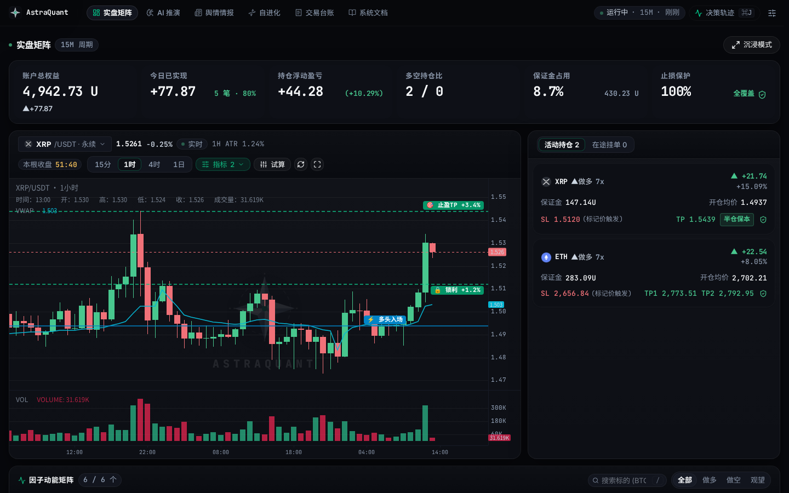
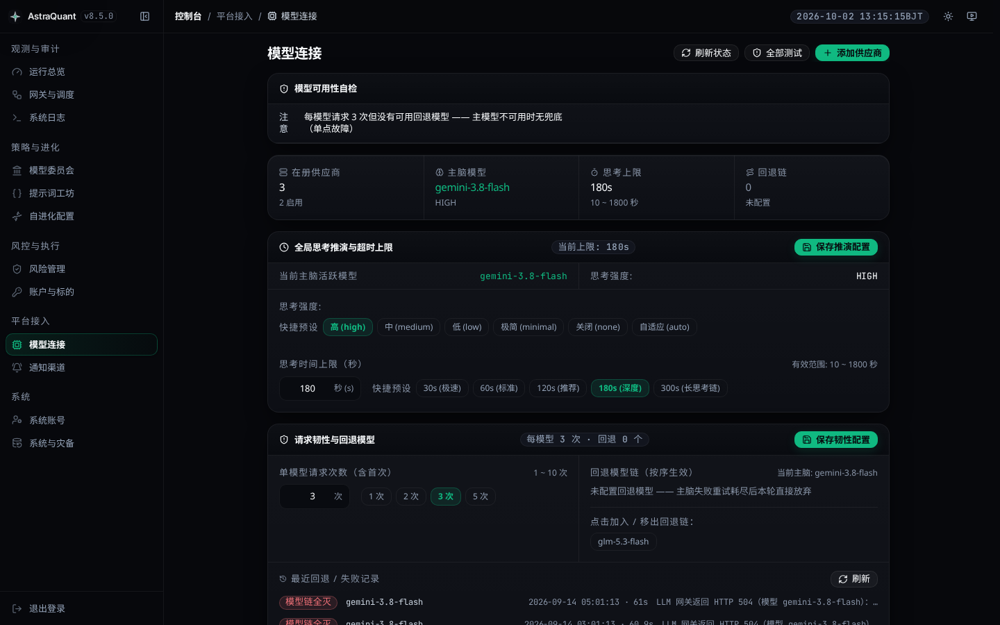

<div align="center">

[简体中文](README.zh-CN.md) · [**English**](README.md)

# AstraQuant

### Institutional-Grade Autonomous Quant Trading OS & Multi-Agent Architecture
#### Adversarial Multi-Model Committee · 7-Tier Derivative Microstructure Calculus · Zero-Trust Deterministic Risk Engine

[](https://github.com/0xethanq/astra-quant-agent/releases)
[](https://www.astraquant.tech)
[](LICENSE)
[](https://www.python.org/)
[](https://fastapi.tiangolo.com/)
[](https://vuejs.org/)
[](tests/)
[](https://linux.do/)

**Heterogeneous AI seats debate → CIO arbitrates → Python physical risk engine vetoes → OKX receives atomic maker limit orders with 100% cloud OCO protection.**

*Cognition belongs to the models; physical verification belongs to mathematical calculus; capital discipline belongs to deterministic code.*

[Quick start](#-quick-start) · [Core Thesis](#-core-thesis) · [Architecture](#-system-architecture) · [7-Tier Calculus](#-7-tier-derivative-microstructure-calculus) · [Multi-Model Committee](#-adversarial-multi-model-committee-council-pro) · [Prompt Caching](#-enterprise-prompt-caching--session-affinity) · [Risk Model](#-institutional-capital-management--risk-model) · [Visual Tour](#-visual-tour) · [Deploy](#-deploy) · [Code Map](#-code-map)

</div>

> 🌟 **AstraQuant is officially launched with, and proudly endorses, the [LINUX DO (linux.do)](https://linux.do/) open-source technical community.**

---

## 💡 Core Thesis: Why Toy Bots Bleed and AstraQuant Prevails

Most cryptocurrency algorithmic trading systems fail in production for three structural reasons:
1. **Single-Model Hallucination & Confirmation Bias**: A single LLM inevitably develops narrative fixation during high-volatility regime shifts. AstraQuant solves this by enforcing **heterogeneous adversarial debate** across independent analytical seats (Macro, Trend, Microstructure, Contrarian) under game-theoretic consensus rules.
2. **Lagging Retail Indicators vs. Derivative Physics**: Traditional moving averages and RSI lag behind market transitions. AstraQuant calculates real-time **continuous derivatives of orderbook liquidity, Cumulative Volume Delta (CVD) divergence, options implied volatility surfaces, and institutional VWAP anchors**.
3. **Soft Prompt Boundaries vs. Hard Capital Risk**: Models must **never** hold execution keys directly. A prompt cannot enforce a stop-loss during an exchange outage or flash crash. AstraQuant enforces a **Zero-Trust Fail-Closed execution seam**: models only hold the right to propose; deterministic Python risk gates hold absolute veto power, and every fill is immediately locked with **100% native exchange-side dual-leg OCO conditional brackets**.

---

## 🚀 Quick start

```bash
git clone https://github.com/0xethanq/astra-quant-agent.git && cd astra-quant-agent
./setup.sh                  # Interactive onboarding wizard (recommended, 2 minutes)
# Or container launch: ./deploy/docker-start.sh. Bare metal: ./deploy/install.sh && ./start.sh
```

| Service Surface | Local Access URL | Authentication / Role |
|---|---|---|
| **Quant Trading Workstation** | `http://localhost:8080/trading` | Institutional Telemetry & Live HUD |
| **Admin Control Plane** | `http://localhost:8080/admin/login` | Superadmin Access (`admin`) |
| **System Docs & OpenAPI** | `http://localhost:8080/docs` | Technical Specifications & API Schemas |

> 🛡️ **Fail-Closed Default**: AstraQuant boots in **demo / paper mode** by default. Live execution remains physically blocked until you provide both LLM provider keys and OKX API keys, verify account connectivity via read-only snapshots, and flip the environment switch on `/admin/security`.

---

## 🏛 System Architecture

AstraQuant operates on a 15-minute institutional brain cycle across four impenetrable architectural boundaries:

```text
                    ┌─────────────────────────────────────────────────────────┐
                    │            AstraQuant Gateway Daemon Scheduler          │
                    │   trader (15m) · news (10m) · factors (60s) · evolve (6h│
                    └────────────────────────────┬────────────────────────────┘
                                                 ▼
   ┌──────────────────────────────────────────────────────────────────────────┐
   │ 1 · 7-TIER DERIVATIVE MICROSTRUCTURE CALCULUS MATRIX                     │
   │   • T0: Funding Rate, Open Interest (OI) acceleration, Elite Long/Short  │
   │   • T0.5: Cumulative Volume Delta (CVD), Whale Taker Net Volume          │
   │   • T1: L2 Orderbook Depth, Order Book Imbalance (OBI), Spread Velocity  │
   │   • T1.5: Options IV Smile Curve, Put/Call Skew, Max Pain Magnet         │
   │   • T2: Term Basis & Calendar Spread Annualized Yield                    │
   │   • T3: Institutional VWAP Footprint (±1σ / ±2σ), VPVR Point of Control  │
   │   • T4: MACD Histogram 1st-order Velocity & 2nd-order Acceleration, ADX  │
   │   → Regime Classification (Trend Expansion / Range Chop / Liquidity Void)│
   └─────────────────────────────────────┬────────────────────────────────────┘
                                         ▼
   ┌──────────────────────────────────────────────────────────────────────────┐
   │ 2 · ADVERSARIAL MULTI-MODEL TRADING DESK (COUNCIL PRO)                   │
   │   • Macro Analyst · Trend Specialist · Quant Microstructure · Risk Gate  │
   │   • Multi-round cross-examination & adversarial challenge                │
   │   • Game-theoretic consensus (Paranoid Veto / Weighted / Alpha Momentum)│
   │   • Chief Investment Officer (CIO) produces machine-validated intent     │
   │   • Prompt Caching: >90% shared market prefix hit rate                   │
   └─────────────────────────────────────┬────────────────────────────────────┘
                                         ▼
   ┌──────────────────────────────────────────────────────────────────────────┐
   │ 3 · ZERO-TRUST PHYSICAL EXECUTION GATES & CIRCUIT BREAKER                │
   │   • Market data completeness verification · Anti-hedging conflict check  │
   │   • Geometric quote validity (Stop < Entry < Target for longs)           │
   │   • Strict Reward:Risk floor (R:R ≥ 2.0) · Maximum leverage ceiling      │
   │   • Single-asset equity quota · Intraday cumulative drawdown breaker     │
   │   ⚠️ ANY CHECK REJECTED OR INDETERMINATE  =  HARD FAIL-CLOSED ABORT      │
   └─────────────────────────────────────┬────────────────────────────────────┘
                                         ▼
   ┌──────────────────────────────────────────────────────────────────────────┐
   │ 4 · OKX-NATIVE MATCHING ENGINE EXECUTION & DUAL-LEG CLOUD BRACKETS       │
   │   • Maker / BBO Limit Order entry to capture passive maker rebates       │
   │   • Dual-Leg Scale-Out: TP1 (1.8× ATR) placed as native reduceOnly leg   │
   │   • Runner Protection: TP2 target with auto-ratchet to breakeven         │
   │   • 100% stop-loss coverage across all legs via exchange-side cloud OCO  │
   │   • Invalidation time stop (8h max hold)                                 │
   └──────────────────────────────────────────────────────────────────────────┘
```

Every transition is verifiable: full Chain-of-Thought transcripts, multi-model debate rounds, 7-tier factor calculus, execution verdicts, and cryptographic `policy_hash` fingerprints are persisted per cycle.

---

## 🔬 7-Tier Derivative Microstructure Calculus

AstraQuant eliminates lagging, curve-fitted technical indicators in favor of continuous derivative calculus:

| Tier | Dimension | Metric & Mathematical Basis | Alpha Impact |
|---|---|---|---|
| **T0** | **Settlement & Positioning** | Funding Rate Velocity, Open Interest (OI) Acceleration, Elite Long/Short Account Ratio | Detects overleveraged crowded positioning and impending liquidation cascades |
| **T0.5** | **Flow & Taker Pressure** | Cumulative Volume Delta (CVD) Divergence, Whale Taker Aggressive Net Inflow | Identifies aggressive institutional buying/selling absorbing passive liquidity |
| **T1** | **Orderbook Microstructure** | Order Book Imbalance (OBI), Top-20 L2 Depth Asymmetry, Slippage Spread | Quantifies immediate physical orderbook resistance and liquidity vacuums |
| **T1.5** | **Options Volatility Surface** | Implied Volatility (IV) Smile, 25-Delta Put/Call Skew, Max Pain Strike Magnet | Reveals institutional tail-risk hedging and expiration gravitational anchors |
| **T2** | **Term Structure** | Annualized Futures-to-Spot Basis, Calendar Roll Yield Spread | Measures macroeconomic carrying cost and institutional cash-and-carry pressure |
| **T3** | **Institutional Footprint** | Volume-Weighted Average Price (VWAP) Bands (±1σ, ±2σ), VPVR Point of Control (POC) | Pins fair-value institutional accumulation zones and mean-reversion extremes |
| **T4** | **Momentum Dynamics** | MACD Histogram 1st Derivative (Velocity) & 2nd Derivative (Acceleration), ADX Vector | Distinguishes genuine high-conviction breakout momentum from false breakout traps |

---

## 👥 Adversarial Multi-Model Committee (Council Pro)

A single LLM cannot navigate complex market regimes without confirmation bias. AstraQuant deploys an institutional trading desk:

- **Specialized Analytical Seats**: Configure distinct models (DeepSeek-V3/R1, Claude 3.5 Sonnet, OpenAI GPT-4o, Qwen 2.5) to assume distinct responsibilities:
  - *Macro Strategy Specialist*: Evaluates geopolitical headlines, central bank policy, and regulatory flows.
  - *Quantitative Microstructure Officer*: Scrutinizes orderbook depth, CVD delta, and options skew.
  - *Technical Momentum Trader*: Identifies high-conviction market structure breaks and volatility expansions.
  - *Contrarian Risk Gatekeeper*: Challenges assumptions, identifies crowded retail traps, and highlights liquidity droughts.
- **Consensus Arbitration Modes**:
  1. **Paranoid Veto**: Any significant risk or liquidity anomaly flagged by a seat triggers an unconditional downgrade to `WAIT`.
  2. **Weighted Majority**: Positions are sized and filtered according to seat confidence ratings and historical rolling win-rates.
  3. **Alpha Momentum**: When microstructure and momentum factors exhibit multi-sigma confluence, momentum seats receive priority execution authority.
- **CIO Machine Contract**: The Chief Investment Officer (CIO) synthesizes debate transcripts into an immutable, schema-compliant JSON order intent.

---

## ⚡ Enterprise Prompt Caching & Session Affinity

AstraQuant solves the token cost and latency bottleneck of multi-agent operations with an institutional **Prompt Caching Architecture (2026-10)**:

```text
┌────────────────────────────────────────────────────────────────────────┐
│ Zone 0 · Immutable System Doctrine & Read-Only Output Schema   [CACHED]│
├────────────────────────────────────────────────────────────────────────┤
│ Zone 1 · Slow-Moving Self-Evolution Lessons (6-hour cadence)   [CACHED]│
├────────────────────────────────────────────────────────────────────────┤
│ Zone 2 · Medium-Moving News Intelligence (10-minute cadence)   [CACHED]│
├────────────────────────────────────────────────────────────────────────┤
│ Zone 3 · Cycle 7-Tier Factor Calculus Matrix (15-minute cadence)[CACHED]│
├────────────────────────────────────────────────────────────────────────┤
│ Zone 4 · High-Frequency Volatile State (Orderbook Ticks, MS)  [DYNAMIC]│
└────────────────────────────────────────────────────────────────────────┘
```

1. **Shared Prefix Broadcasting (>90% Cache Hit Rate)**: Over 90% of the prompt context consists of static doctrine, risk rules, and multi-symbol factor matrices. Council seats broadcast over this shared prefix with session affinity, achieving sub-second Time-To-First-Token (TTFT) and slashing LLM operational expenses by 70%+.
2. **Monotonic Volatility Hierarchy**: Strict ordering by mutation frequency prevents high-frequency tail changes from busting the stable prefix cache.
3. **Claude Ephemeral Breakpoints**: Native injection of `cache_control: {"type": "ephemeral"}` at Zone boundaries; 64/128-token chunk boundary alignment for DeepSeek and OpenAI.
4. **Float Anti-Jitter Stabilization**: Deterministic rounding prevents microscopic floating-point noise from invalidating upstream KV cache blocks.
5. **L1 In-Memory & SQLite Local Query Cache**: Blocks redundant remote calls during council debates and failover recovery.

---

## 🛡️ Institutional Capital Management & Risk Model

AstraQuant operates on **Dynamic Risk Parity** scaled to real-time account equity. All parameters below are the enforced production baseline (`scripts/risk_constants.py`):

| Risk Dimension | Formula & Operational Ceiling | Strategic Objective & Defense Mechanism |
|---|---|---|
| **Max Risk per Trade (1R)** | `min(Asset Cap, Equity × 4.5%)` | Strict capital allocation; limits single-position ruin probability |
| **Max Margin per Trade** | `Equity × 40.0%` | Prevents over-concentration in volatile market conditions |
| **Single-Asset Total Margin** | `Equity × 48.0%` | Caps portfolio exposure to any single cryptocurrency asset |
| **Intraday Drawdown Breaker** | `min(500 USDT, Equity × 10.0%)` | Non-bypassable emergency circuit breaker; halts new entries for 24h |
| **Dynamic Leverage Clamp** | `3.0x – 8.0x` (volatility-adjusted) | Dynamically clamped by market liquidity and instrument ATR |
| **Expected Reward:Risk Floor** | `R:R ≥ 2.0` (Cap at 5.0) | Enforces positive mathematical expectancy; blocks low-yield chasing |
| **Volatility-Adaptive Stop** | `1.8x – 2.2x × ATR(1H)` | Provides structural breathing room; prevents noise washouts |
| **Dual-Leg Scale-Out (TP1)** | `35% – 50%` at `1.8 × ATR` | Realized profit lock via independent `reduceOnly` exchange leg |
| **Trend Runner Leg (TP2)** | Terminal structural target | Runner captures high-beta trends; stop ratchets to breakeven post-TP1 |
| **Stop-Loss Coverage** | **100.0%** Cloud OCO Coverage | Both legs locked with native cloud conditional stops on OKX |
| **Time Invalidation Stop** | `8 hours` maximum holding period | Frees locked capital if expected momentum fails to expand |
| **Correlated Directional Quota**| `≤ 4` concurrent same-direction | Isolates portfolio from systemic cryptocurrency beta cascade |
| **Post-Stop Cooling Period** | `15 minutes` per instrument | Mandatory programmatic cooldown to eliminate emotional revenge trading |

---

## 📸 Visual Tour

| | |
|---|---|
| **Institutional Trading Workstation**<br> | **Chain-of-Thought (CoT) Deep Drawer**<br> |
| **7-Tier Microstructure Matrix**<br> | **Multi-Model Committee Board**<br> |
| **Prompt Engineering Studio**<br> | **Closed-Loop Self-Evolution Hub**<br> |
| **Execution Risk Control Center**<br> | **Policy Snapshots & Atomic Rollback**<br> |
| **LLM Gateway & Thinking Config**<br> | **System Governance & Admin Overview**<br> |
| **Security & Credential Plaza**<br> | **Microstructure Live Telemetry**<br> |

---

## 🎨 Prompt Engineering & Semantic Sockets

All prompt doctrine is consolidated in `data/prompt_library.json`. Python contains zero prompt prose:

- **Read-Only Output JSON Schema**: The model's response contract is defined in code (`scripts/ai_brain_trader.py`). The Prompt Studio locks it as read-only to eliminate parsing failures.
- **8 Dynamic Semantic Variable Slots**:
  - `{{decision_timestamp}}`: Precise Beijing Time (UTC+8) execution baseline.
  - `{{account_balance}}`: Real-time available USDT cash and total equity.
  - `{{risk_budget}}`: Dynamically computed 1R risk budget and margin ceilings.
  - `{{account_positions}}`: Realized ROI, High Water Mark (HWM), and drawdown metrics.
  - `{{pending_orders}}`: Active maker limit orders awaiting fill or cancelation.
  - `{{market_matrix}}`: Continuous 7-tier derivative factor calculus across active universe.
  - `{{news_intelligence}}`: Macroeconomic headlines and weighted sentiment ratings.
  - `{{trading_memory}}`: Heuristic lessons distilled from real closed-trade ledgers.

📖 Authoring guide & seat templates: **[`docs/PROMPT_GUIDE.md`](docs/PROMPT_GUIDE.md)**

---

## 📊 Telemetry & Observability

| Daemon / Logger | Target Log Path | Subsystem Scope |
| :--- | :--- | :--- |
| `trader` | `logs/ai_factor_trader.log` | Brain cycle, debate transcripts, factor snapshots, OCO brackets |
| `backend` | `logs/uvicorn.log` | FastAPI control plane, REST endpoints, telemetry synchronization |
| `scheduler` | `logs/astra_gateway.log` | Distributed lease locks, cron cadence, health heartbeats |
| `audit` | `logs/astra_admin_audit.jsonl` | Append-only security audit log (Timestamp, Actor, IP, Action) |

Both Docker containers run an internal supervised watchdog. Prometheus metrics (`/api/v1/admin/metrics`) and pre-configured Grafana boards are located in [`deploy/observability/README.md`](deploy/observability/README.md).

---

## 🧪 Automated Testing & Invariant Gates

Every claim in AstraQuant is defended by strict regression gates:

```bash
# 1. Tier 0: Core Quant & Execution Gates (~20s)
.venv/bin/pytest tests/trading tests/venues tests/risk tests/backtest -n auto -q

# 2. Tier 1: Multi-Model & Frontend Integration Gates (~60s)
.venv/bin/pytest tests/llm tests/ui tests/core -n auto -q
cd frontend && npm run build && npx vue-tsc --noEmit && node --test tests/*.test.mjs && cd ..

# 3. Tier 2: Architectural Audit & Invariant Gates (~90s)
.venv/bin/pytest tests/audit tests/extraction tests/ops -n auto -q
```

---

## 🚀 Deploy

### Option A 🐳 Docker (Recommended — Zero Host Dependencies)

```bash
git clone https://github.com/0xethanq/astra-quant-agent.git && cd astra-quant-agent
./setup.sh                  # Interactive CLI onboarding wizard (supports --non-interactive)
./deploy/docker-start.sh    # Builds and launches backend & gateway daemons

docker compose ps           # Verify container health
docker compose logs -f      # Follow aggregated logs
```

### Option B Bare Metal Linux / macOS

```bash
git clone https://github.com/0xethanq/astra-quant-agent.git && cd astra-quant-agent
sh deploy/install.sh        # Creates .venv, upgrades pip, installs pinned dependencies
./setup.sh                  # Generates and secures .env (chmod 600)
cd frontend && npm install && npm run build && cd ..
./start.sh                  # Launches FastAPI control plane on http://0.0.0.0:8080
```

Systemd production service units: `deploy/astra-quant.service` and `deploy/astra-gateway.service`.

---

<a id="code-map"></a>
## 🗂 Code map

> ⚠️ This repository has **never contained an `OPENCODE.md`**. Authoritative architectural entry points:

| Domain | Specification Document | Key Scope |
|---|---|---|
| **Architecture Overview** | [`docs/STRUCTURE_OVERVIEW.md`](docs/STRUCTURE_OVERVIEW.md) | Layered architecture and subsystem directory layout |
| **Backend Layering** | [`astra_backend/README.md`](astra_backend/README.md) | Backend layering (L0 Facade / L1 Wiring / L2 Routes / L3 Domain / L4 Subpackages) |
| **Runtime Scripts & Daemons**| [`scripts/README.md`](scripts/README.md) | Runtime scripts & daemons (38 root-level scripts, daemons, and scheduling mechanics) |
| **Prompt Engineering** | [`docs/PROMPT_GUIDE.md`](docs/PROMPT_GUIDE.md) | JSON-only prompt library, 8 semantic slots, council doctrines |
| **Failure Semantics** | [`docs/FAILURE_SEMANTICS.md`](docs/FAILURE_SEMANTICS.md) | Real-world failure post-mortems and defensive invariants |
| **Beijing Time Contract** | [`docs/BEIJING_TIME_CONTRACT.md`](docs/BEIJING_TIME_CONTRACT.md) | Unified UTC+8 financial accounting and settlement foundation |
| **Frontend Architecture** | [`frontend/src/components/admin/README.md`](frontend/src/components/admin/README.md) | Frontend components & state (Vue 3, composables, stores) |
| **Standalone Deployment** | [`STANDALONE.md`](STANDALONE.md) | Environment configuration and host-native execution |
| **Disaster Recovery** | [`RECOVERY_GUIDE.md`](RECOVERY_GUIDE.md) | Emergency liquidation and state recovery playbooks |
| **Observability** | [`deploy/observability/README.md`](deploy/observability/README.md) | Prometheus metrics scraping and Grafana dashboards |

**Gates watching this repository:**

| Gate | What it prevents |
|---|---|
| `tests/audit/test_directory_docs_current.py` | A module existing without being registered in its `__init__.py` **and** its `README.md` |
| `tests/core/test_readme_baseline_numbers.py` | Documented test counts rotting away from reality |
| `tests/audit/test_doc_paths_are_committed.py` | Documentation pointing at paths that do not exist or are not committed |
| `tests/audit/test_brand_strings_are_consistent.py` | Brand / namespace drift that would break live production data |
| `tests/audit/test_deployment_scripts_are_sound.py` | Startup or Docker scripts that cannot actually start the project |

---

## 🏷 Brand & Namespace Governance

- **Public Brand**: **AstraQuant** — <https://www.astraquant.tech>
- **Internal Namespace**: **`astra`** (packages `astra_backend`, `astra_gateway`; configuration prefix `ASTRA_*`)

### Intentional Legacy Markers — Do Not Rename

Three historical markers are intentionally preserved to protect live production state and open positions (`tests/audit/test_brand_strings_are_consistent.py`):
1. **Exchange leg tags `t-r20sl*` / `t-r20tp*`**: Open orders placed prior to namespace upgrade remain live on exchange matching engines. Preserved so cloud ratchets maintain tracking; new orders use `astrasl` / `astratp`.
2. **Encrypted backup magic `R20GCM2` + NUL**: Historic backups must remain decryptable. New archives use `ASTRAGCM`.
3. **`cpa.r20.cn` in test fixtures**: The maintainer's internal DNS gateway for upstream LLM routing, not a repository namespace.

---

## 🤝 Community

AstraQuant officially links to and endorses the **[LINUX DO (linux.do)](https://linux.do/)** open-source community.

- 🐧 **Technical Soil**: Sincere gratitude to LINUX DO for strategy inspiration, architecture feedback, and quant discussions.
- 💬 **Collaborate**: Multi-agent prompt engineering, risk parameters, and autonomous crypto quant research.

---

## ⚠️ Disclaimer

1. This project is an **open-source algorithmic trading framework and quantitative research system**, created strictly for academic research, education, and simulation purposes.
2. Cryptocurrency derivatives trading entails significant capital risk and extreme volatility. Historical backtests do not guarantee future performance.
3. Users must maintain comprehensive risk management practices and validate strategies thoroughly in **DEMO / paper trading** before committing live capital.
4. The authors and contributors assume zero liability for financial losses incurred through the deployment of this software.

---

## 📄 License

AstraQuant is distributed under the **[GNU Affero General Public License v3.0 (AGPL-3.0)](LICENSE)** with the **[Commons Clause Condition v1.0](LICENSE)** and Special Anti-Scam / Anti-Reskin Addendum.

- 🔓 **Free for Research & Proprietary Trading**: Full source code available for academic study, individual backtesting, and self-hosted proprietary trading.
- 🛡️ **Network-Use Copyleft (AGPLv3)**: Any modified or derivative version made accessible over a computer network (Web UI, API, or bot service) must release its complete corresponding source code under the same terms.
- 🚫 **No Commercial Resale or Paid Signals (Commons Clause)**: You may not sell the software, package it as closed-source commercial software, or operate paid signal/copy-trading subscription services derived from this software without explicit written permission.
- ⚖️ **Anti-Scam Rider**: Strictly prohibits any use of this project for fraudulent financial schemes, token issuance, or unauthorized commercial endorsement.
